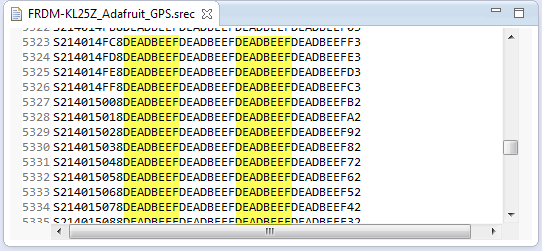
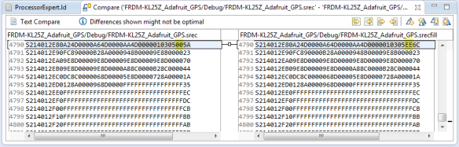
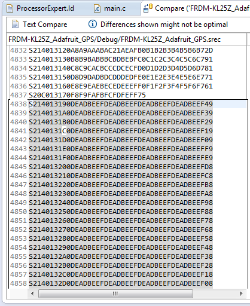
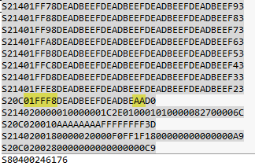

<p align="center">
  <a href="" rel="noopener">
 </a>
</p>

<h3 align="center">Clion</h3>

<div align="center">

[]()
[](https://github.com/kylelobo/The-Documentation-Compendium/issues)
[](https://github.com/kylelobo/The-Documentation-Compendium/pulls)
[](/LICENSE)

</div>

---

<p align="center"> Few lines describing your project.
    <br> 
</p>

## 📝 Table of Contents

- [About](#about)
- [FILLing unused Memory with the GNU Linker](#filling_memory)
- [Deployment](#deployment)
- [Usage](#usage)
- [Built Using](#built_using)
- [TODO](../TODO.md)
- [Contributing](../CONTRIBUTING.md)
- [Authors](#authors)
- [Acknowledgments](#acknowledgement)

## 🧐 About <a name = "about"></a>

Write about 1-2 paragraphs describing the purpose of your project.

## FILLing unused Memory with the GNU Linker <a name = "filling_memory"></a>

In many of my applications I use a CRC/checksum to verify that the code/flash on the target is not modified. For this, not only the code/data in flash counts, but as well all the unused gaps in the memory map. Instead to leave it up to the flasher/debugger (which usually erases it to 0xFF), I want to fill it with my pattern. The GNU linker is using the pattern 0x00 for unused bytes inside sections. So this post is about to use the GNU linker to ‘fill’ the uninitalized FLASH memory with a pattern.
[FLASH with DeadBeef Pattern](./image/deadbeef-pattern.png)



### =fill Linker File Command

The GNU linker has a way to fill a section. The GNU linker documenation lists the SECTIONS syntax as:

```
SECTIONS {
...
secname start BLOCK(align) (NOLOAD) : AT ( ldadr )
{ contents } >region :phdr =fill
...
}
```
The interesting thing is the =fill at the end: here I can specify an expression which then is used to fill the section:

```
=fill

Including =fill in a section definition specifies the initial fill value for that section. You may use any expression to specify fill. Any unallocated holes in the current output section when written to the output file will be filled with the two least significant bytes of the value, repeated as necessary. You can also change the fill value with a FILL statement in the contents of a section definition.
```
For example
```
.text :
  {
    . = ALIGN(4);
    *(.text)           /* .text sections (code) */
    *(.text*)          /* .text* sections (code) */
    *(.rodata)         /* .rodata sections (constants, strings, etc.) */
    *(.rodata*)        /* .rodata* sections (constants, strings, etc.) */
    *(.glue_7)         /* glue arm to thumb code */
    *(.glue_7t)        /* glue thumb to arm code */
    *(.eh_frame)

    KEEP (*(.init))
    KEEP (*(.fini))

    . = ALIGN(4);

    _etext = .;        /* define a global symbols at end of code */
  } > m_text =0xEE
```
Will fill my section with the 0xEE byte pattern. I can verify this when I compare the generated S19 files (see [“Binary (and S19) Files for the mbed Bootloader with Eclipse and GNU ARM Eclipse Plugins“](https://mcuoneclipse.com/2014/04/20/binary-files-for-the-mbed-bootloader-with-eclipse-and-gnu-arm-eclipse-plugins/)):

[Inserted Fill Byte](./image/inserted-fill-byte.png)


❗ The =fill applies only *inside* an output section, so does not fill the space between output sections!

### FILL() Linker Command

The =fill applies to the output section. But if I want to fill different parts within an output section, then the FILL command should be used:

```
FILL(expression)
Specify the “fill pattern” for the current section. Any otherwise unspecified regions of memory within the section (for example, regions you skip over by assigning a new value to the location counter ‘.’) are filled with the two least significant bytes from the expression argument. A FILL statement covers memory locations after the point it occurs in the section definition; by including more than one FILL statement, you can have different fill patterns in different parts of an output section.
```

My favorite FILL command is this one:

```
FILL(0xDEADBEEF)
```

or

```
FILL(0xDEADC0DE)
```

### Filling Memory *Outside* Sections

While the above =fill and FILL() examples are fine, they only fill *inside* a section.

For example for my KL25Z I have following MEMORY defined in the linker file:

```
MEMORY {
  m_interrupts (RX) : ORIGIN = 0x00000000, LENGTH = 0x000000C0
  m_cfmprotrom  (RX) : ORIGIN = 0x00000400, LENGTH = 0x00000010
  m_text      (RX) : ORIGIN = 0x00000410, LENGTH = 0x0001FBF0
  m_data      (RW) : ORIGIN = 0x1FFFF000, LENGTH = 0x00004000
}
```

The linker will place my code and constant data into the m_text output section. I will not fill up all the 128 KByte of FLASH, so the end of m_text will not be filled with the above examples. So how to fill the rest of m_text up to the address 0x1’FFFF (end of FLASH memory)?

The trick is to add a special output section at the end which then gets filled with a pattern. For this I need find what is the last section put into m_text. Looking at my linker script file there is this:

```
.fini_array :
  {
    PROVIDE_HIDDEN (__fini_array_start = .);
    KEEP (*(SORT(.fini_array.*)))
    KEEP (*(.fini_array*))
    PROVIDE_HIDDEN (__fini_array_end = .);

    ___ROM_AT = .;
  } > m_text
```

So .fini_array is the last thing for m_text, and it defines a linker symbol ___ROM_AT which marks the end of the ROM. What I do now is to create a new output section .fill and move the ___ROM_AT symbol:

```
  .fini_array :
  {
    PROVIDE_HIDDEN (__fini_array_start = .);
    KEEP (*(SORT(.fini_array.*)))
    KEEP (*(.fini_array*))
    PROVIDE_HIDDEN (__fini_array_end = .);

    /*___ROM_AT = .; */
  } > m_text
  
  .fill :
  {
    FILL(0xDEADBEEF);
    . = ORIGIN(m_text) + LENGTH(m_text) - 1;
    BYTE(0xAA)
    ___ROM_AT = .;
  } > m_text
```

- Using the FILL command to define the pattern (0xdeadbeef)
- Setting the current section cursor (.) at the last byte of the m_text MEMORY area
- Writing a value to that location with the BYTE() command. Note that this byte is technically needed, as the linker needs to have something in the output section.
- Defining the ___ROM_AT symbol. My linker file is using that symbol later. If your linker file does not need this, you do not need this line.

After that, I get the unused FLASH filled with a DEADBEEF pattern:

[Filled FLASH Memory with 0xdeadbeef](./image/filled-flash-memory-with-0xdeadbeef.png)


And the end has as expected at 0x1FFFF the 0xAA byte:

[0x1FFFF filled with 0xAA](./image/0x1ffff-filled-with-0xaa.png)



### Summary
Filling the unused FLASH memory with a defined pattern is a very useful thing: it makes the memory defined e.g. for a checksum calculation. Additionally it can increase the reliability of an application: I can fill the FLASH memory with an illegal instruction or HALT instruction: so when my application would jump into undefined memory, I can bring the system to a screeching halt.

To use a fill pattern inside a section is very easy with the GNU linker (ld). To fill unused memory outside of output sections, I’m using a dedicated .fill section as shown in this post.

## 🔧 Running the tests <a name = "tests"></a>

Explain how to run the automated tests for this system.

### Break down into end to end tests

Explain what these tests test and why

```
Give an example
```

### And coding style tests

Explain what these tests test and why

```
Give an example
```

## 🎈 Usage <a name="usage"></a>

Add notes about how to use the system.

## 🚀 Deployment <a name = "deployment"></a>

Add additional notes about how to deploy this on a live system.

## ⛏️ Built Using <a name = "built_using"></a>

- [MongoDB](https://www.mongodb.com/) - Database
- [Express](https://expressjs.com/) - Server Framework
- [VueJs](https://vuejs.org/) - Web Framework
- [NodeJs](https://nodejs.org/en/) - Server Environment

## ✍️ Authors <a name = "authors"></a>

- [@kylelobo](https://github.com/kylelobo) - Idea & Initial work

See also the list of [contributors](https://github.com/kylelobo/The-Documentation-Compendium/contributors) who participated in this project.

## 🎉 Acknowledgements <a name = "acknowledgement"></a>

- Hat tip to anyone whose code was used
- Inspiration
- References
